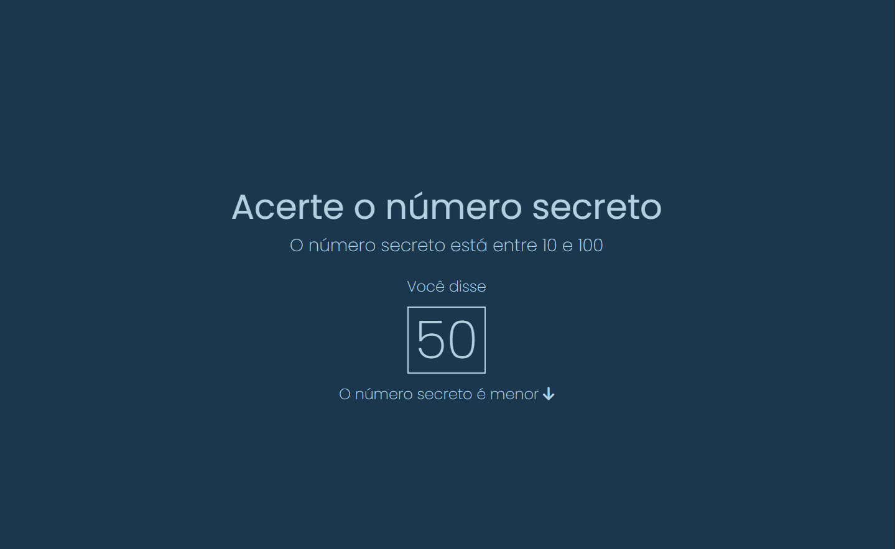
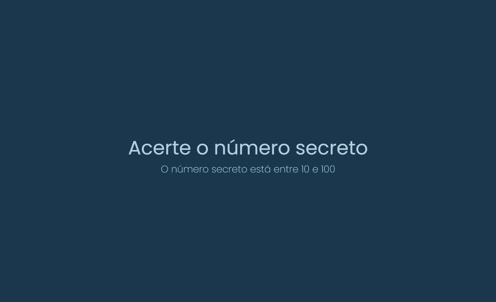

# Número Secreto | JavaScript: validações e reconhecimento de voz

Repositório com projeto Número Secreto desenvolvido durante o curso JavaScript para Web: Crie páginas dinâmicas da [Alura](https://www.alura.com.br/) Escola Online de Tecnologia.

## 📁 Detalhes do projeto

	

 

O Número Secreto é um jogo online, onde um número é sorteado aleatoriamente e o usuário deve tentar descobrir que número é este.

O desafio desta aplicação foi criar uma lógica para o sorteio do número, para as validações e também para o reconhecimento de voz.

Para o reconhecimento de voz foi usada a Web Speech API.

## 📚 Temas abordados

* Gerar número aleatório;
* Incorporar dados de voz com Web Speech API;
* Manipular dados de voz;
* Exibir mensagem na tela de forma dinâmica com template string;
* Verificar se dados são válidos com condicionais;
* Exibir tela de sucesso e de game over;
* Criar um botão que reinicia o jogo de forma dinâmica.

## 🖥️ Acesso ao projeto

[Clique aqui](https://numero-secreto-alpha.vercel.app/) para acessar o Número Secreto no seu navegador.

Após acessar o projeto basta falar o seu chute no microfone do seu dispositivo.

Caso não acerte o número de primeira, algumas dicas te ajudarão a seguir no jogo.

	

 

Alguns navegadores podem solicitar uma permissão para ativar o microfone do seu dispositivo.

## 👩‍💻 Tecnologias utilizadas

	
	
	

Desenvolvido com 💙 por [Juliana Lucca](https://www.linkedin.com/in/julianalucca/)